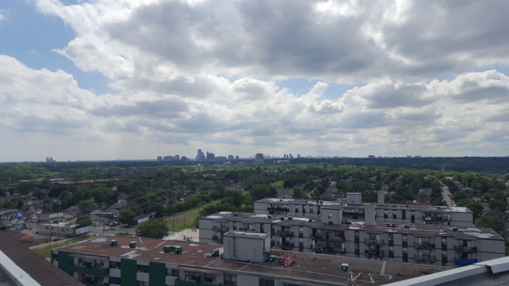
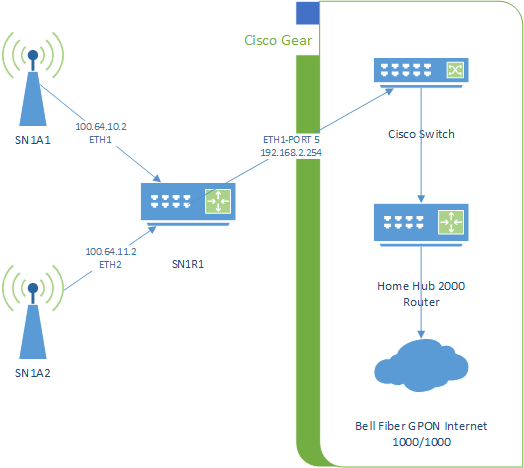
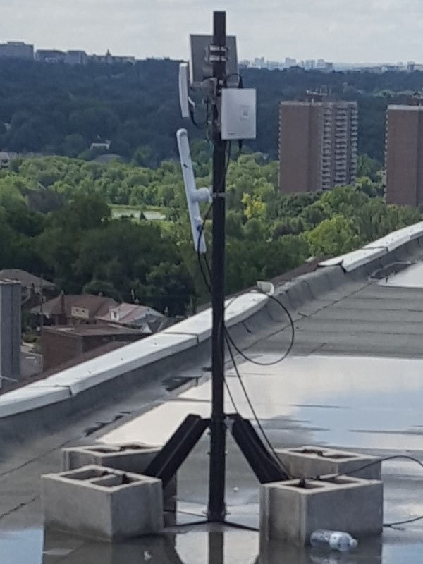
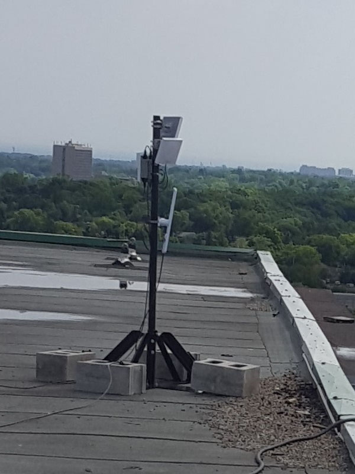

# Supernode 1

Location: 200 Woolner Ave, Toronto

**Notes**  
The supernode was deployed along side a Cisco deployed infustructure belonging to the City of Toronto.

## Network

The supernode consists of 2 antennas and a router. The router is connected to the Cisco switch which in turn is connected to the Bell 2000 modem that offers internet access for use as a gateway path.

The router acts as a Babel routing device. The antennas are configured in bridge mode.

## Hardware

### Antenna 1

Antenna 1 is a Ubiquiti LAP-120 mounted on the West arm of the building, south side of the roof colocated with Cisco on their mounts. It is facing south.

### Antenna 2

Antenna 2 is a Ubiquiti LAP-120 mounted on the south arm of the building, east side of the roof colocated with Cisco on their mounts. It is facing east.

### Router 1

Router 1 is a Ubiquti EdgeRouter X-SFP mounted in the inside Cisco cabinate in the ballast room.

## Enviroment

The router is installed in a black metal encosure located on the back wall of the ballast tank room on top of 200 Woolner. This room is accessable only from the roof. The entrance is on the east wall of the elevator hut. The doors are shorter then normal.

Network cables are run through a hole in the east wall.