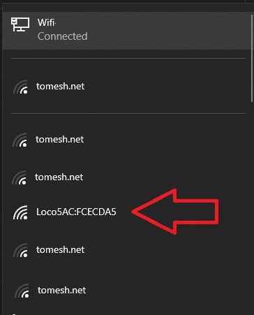
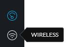
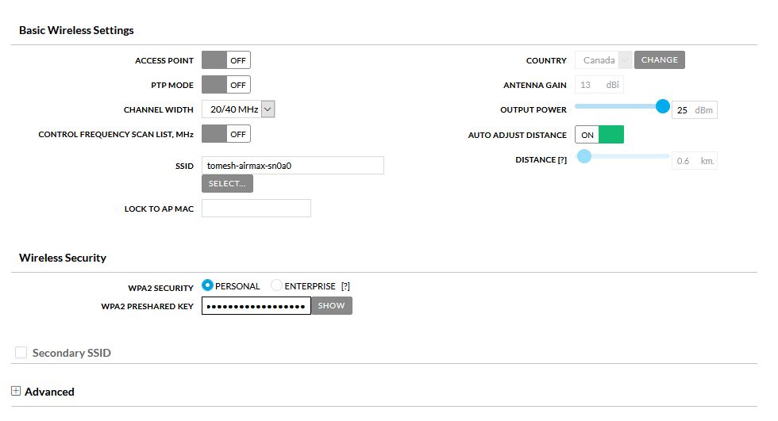
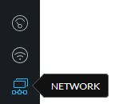
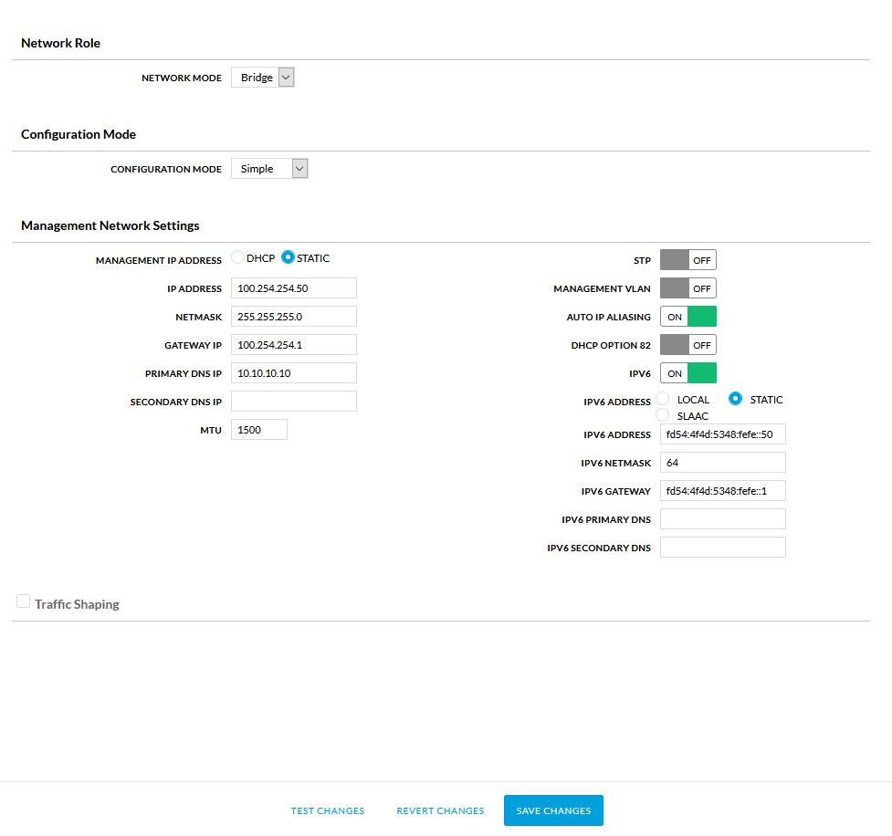
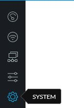
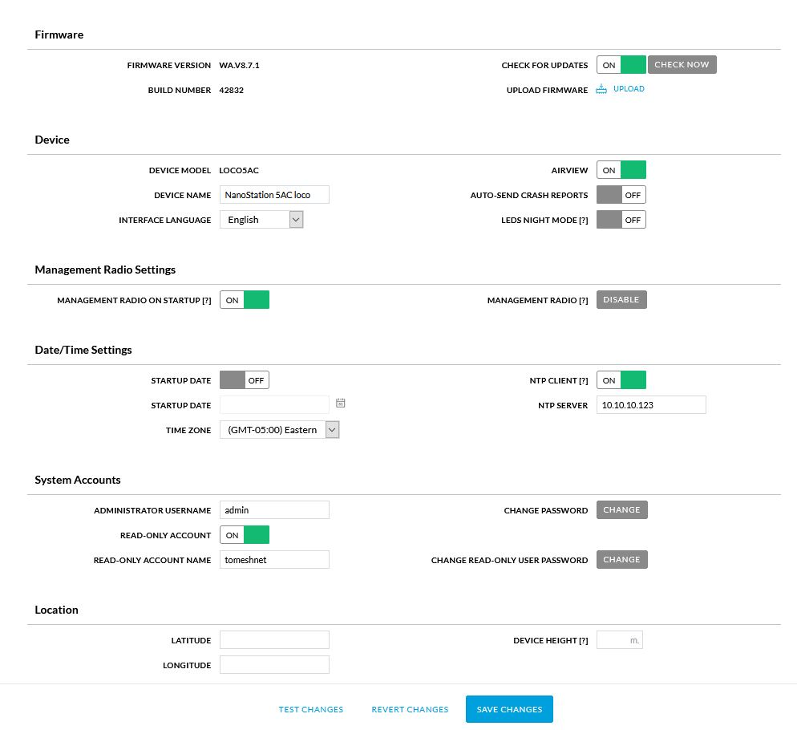

# CPE - Ubiquiti

This document covers setup for the following devices. Other devices may be similar.

- [Loco5AC](https://www.ui.com/airmax/nanostation-ac/)
- [LBE‑5AC‑23](https://www.ui.com/airmax/litebeam-ac/)

## What you will need

You will need to collect the following information:

- SSID of the supernode antenna you wish to connect to
- Your assigned node name
- Your assigned `IP Address`, `Netmask` and `Gateway`
- A computer with WiFi for use with the [management radio](#connect-using-the-management-radio) method or a computer with a network port for the [Ethernet cable](#connection-using-an-ethernet-cable) method.
## Connecting to the CPE for the first time

### Connect using the Management Radio

Most devices come with a second `Management Radio` that is active for a short period of time after the device is powered on.  While active it creates a wireless access point dedicated to configuration of the device. This access point can be used to connect a laptop or phone to it over Wi-Fi. The IP address of this interface static and will never change.

1. Connect to the Management Radio access point of the device. It should be a combination of the name of the unit and the `MAC` address.

  

**NOTE** The Management Radio only is only on for a short period of time after boot. If the device cannot be found power cycle it by unplugging the device from the POE injector, wait 10 seconds, and plug it in again.

2. Once the WiFi connection is establish, open the browser and visit `https://192.168.172.1/`

### Connect using an Ethernet Cable

Device can be connected to using an Ethernet cable. This method requires the knowledge of the device's IP address. If the device has been previously configured, and the IP address is known, adjust the steps below accordingly. If the IP address is not known, a factory reset can be performed by pressing the reset button for 30 seconds. This will erase all settings on the device and set the default IP address of 192.168.1.20 again.

1. Plug a network cable into your computer and into the `Network` port of your `POE injector`

2. Configure your laptop's network interface to `192.168.1.50`.

3. Open the browser and visit `https://192.168.1.20/`

### First time configuration

1. If there is a warning about a certificate, process anyway.
    - Firefox: Press Advanced, then `Accept the Risk and continue`
    - Chrome: Press Advanced, then `Proceed to xxx.xxx.xxx.xxx (unsafe)`

2. Select the country as `Canada`

3. Accept the user `EULA`

4. Click `Continue`

5. Choose Your username and password for the device. TCN Standard username is `tomesh`

### Configure Wireless

1. Select the `Wireless` icon from the left menu

 

2. Enter the remote antennas SSID under `SSID`

3. Enter the `WPA2 PRESHARED KEY`. TCN standard key is `torontocommunitynetwork`
 

4. Select `Save Changes`

### Configure Network

1. Select the `Network` icon from the left menu

 

2. Set the `IP ADDRESS` to the address assigned to your node

3. Set the `NETMASK` if needed. The default is `255.255.255.0` and used in most instances

4. Enter the `GATEWAY` assigned to your node. Usually same as your `IP ADDRESS` but ending in `1`

5. Set the DNS to `10.10.10.10`

6. Set `IPV6` address to `STATIC`

7. Enter `IPV6 ADDRESS`, `IPV6 NETAMSK` and `IPV6 GATEWAY` to values provided. `IPV6 NETAMSK` is usually `64`

 

8. Select `Save Changes`

**NOTE** If you are using a network cable method of connecting to the device, you will need to change your IP address of your computer to the same network as you entered in the `IP ADDRESS` field. Simply select a different at the end. For example, if your assigned IP address is `100.64.10.55` set your computer to `100.65.10.200`. You will have to use your browser to visit https://`YOUR ASSIGNED IP` for example `https://100.64.10.55`

### Configure System

1. Select the `System` icon from the left menu

 

2. Set `DEVICE NAME` to your assigned node name

3. Toggle `NTP CLIENT` on

4. Set `NTP SERVER` to `10.10.10.123`

5. Set `TIMEZONE` to `(GMT -05.00) Eastern`

6. Toggle `READ-ONLY ACCOUNT` on

7. Set `READ-ONLY ACCOUNT NAME` to `ubnt`

8. Click `CHANGE` next to `Change Read Only User Password` and set the password to `tomeshnet`

9. Fill out the location section.

  

10. Select `Save Changes`
