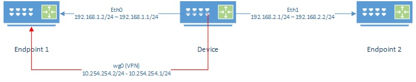

# Hardware Benchmark

## Lab setup

`Device` Device being tested  

`Endpoint1`, `Endpoint2` Devices not limited by CPU or network.



Instructions below are non-persistent. When device is restarted changes will be removed. `wireguard` package must be installed.

### Device Lab Configuration

#### Configure interfaces

Configure the IP addresses on each interface

`eth0` Interface on device connected to `Endpoint 1`
`eth1` Interface on device connected to `Endpoint 2`


```
ifconfig eth0 NETMASK 255.255.255.0
ifconfig eth0 192.168.1.1 up

ifconfig eth1 NETMASK 255.255.255.0
ifconfig eth1 192.168.2.1 up
```
*Note: You can add other IP addresses to an interface by using the `ethx:x` notation such as `eth0:1`.  This can be used to add your home IP address alongside the lab's IP address and share the same switch*

*For example `ifconfig eth0:1 192.168.10.1`*


**Enable Routing**

Most Linux distributions have routing disable. Enable it.

`echo 1 > /proc/sys/net/ipv4/ip_forward`

**Wireguard**

Configure a Wireguard server. Create a configuration file `wg0.conf` containing a private/public key.

*NOTE: Do not use these keys in production!* 

```
cat <<"EOF"> wg0.conf
[Interface]
PrivateKey = 4LMdS6DPRe5gHcmMWYhZqlM9PzFTEeDz0kz0YIMCPm0=
ListenPort = 1000

[Peer]
PublicKey = //C9KkNgCgT/0+bIb6YMS558xNx6wJOwAuGbqO8CGlI=
AllowedIPs = 0.0.0.0/0
AllowedIPs = ::/0
EOF
```

Bring up the `wg0` interface using above configuration

```
ifconfig wg0 down
ip link del dev wg0
ip link add dev wg0 type wireguard
wg setconf wg0 wg0.conf
ip addr add 10.254.254.1/24 dev wg0
ifconfig wg0 up
```


### Endpoint1 Lab Configuration

**Configure interfaces**

Configure the IP addresses the interface. Make the default route the `Device`.

`eth0` Interface on device connected to `Device`

```
ifconfig eth0 NETMASK 255.255.255.0
ifconfig eth0 192.168.1.2 up
ip route add 0.0.0.0/0 via 192.168.1.1
```

**WireGuard**

Configure a Wireguard client.  Create a configuration file `wg0.conf` containing a private/public key.

*NOTE: Do not use these keys in production!* 

```
cat <<"EOF"> wg0.conf
[Interface]
PrivateKey = cFP6gBOZrvqlt/XkdT7Cp6HOLuNMYa6yVNcCR+e9IEw=
ListenPort = 1000

[Peer]
PublicKey = 1510YjIH8EfQtJ2zxEEUb5+1B4HqmIv86pwpkJwNOW4=
AllowedIPs = 0.0.0.0/0
AllowedIPs = ::/0
Endpoint = 192.168.1.2:1000
EOF
```

Bring up the `wg0` interface using above configuration.

```
ifconfig wg0 down
ip link del dev wg0
ip link add dev wg0 type wireguard
wg setconf wg0 wg0.conf
ip addr add 10.254.254.2/24 dev wg0
ifconfig wg0 up
```

### Endpoint2 Lab Configuration

**Configure interfaces**

Configure the ip addresses the interface. Make the default route the `Device`.

`eth0` Interface on device connected to `Device`

```
ifconfig eth0 NETMASK 255.255.255.0
ifconfig eth0 192.168.1.2 up
ip route add 0.0.0.0/0 via 192.168.2.1
```

## Testing

`iperf3` package must be installed. During `iperf3` tests there are several things to remember:

- iperf3, when run on device with low CPU resources, can consume CPU power to generate packets. Speed when transmitting will be slower than when receiving since the CPU will be taxed more.

- CPU load can be seen by using the `top` command during the test

- Watching  `/proc/interrupts` can also show where CPU cycles are being spent.

- Some devices have hardware offloading that can increase performance when routing through the device.

### Interface speed

This will test the interface speed between the `Device` and `Endpoint1`.  

On `Endpoint1`:

`iperf3 -s`

On `Device`:

- Test Forward speed
`iperf3 -c 192.168.1.2`

- Test Reverse speed
`iperf3 -c 192.168.1.2 -R`


### Wireguard to Wireguard

This will test the interface speed over Wireguard. 

On `Endpoint1`:

`iperf3 -s`

On `Device`:

- Test Forward speed
`iperf3 -c 10.254.254.2`

- Test Reverse speed
`iperf3 -c 10.254.254.2 -R`

### Endpoint2 through Device to Endpoint1

This test will show how well the `Device` can route packets between subnets.

On `Endpoint1`:

`iperf3 -s`

On `Endpoint12`:

- Test Forward speed
`iperf3 -c 192.168.1.2`

- Test Reverse speed
`iperf3 -c 192.168.1.2 -R`


### Endpoint2 through Device over WG to Endpoint1

This test will show how well the `Device` can route packets between subnets while encrypting traffic over the `wg0` interface.

An additional route needs to be added on Endpoint1 to send all packets back over wg0 when doing reverse test.

On `Endpoint1`:

`ip route add 192.168.2.0/24 dev wg0`
`iperf3 -s`


On `Endpoint2`:

- Test Forward speed
`iperf3 -c 10.254.254.2`

- Test Reverse speed
`iperf3 -c 10.254.254.2 -R`

On Endpoint1 (once completed test):
`ip route delete 192.168.2.0/24 dev wg0`
