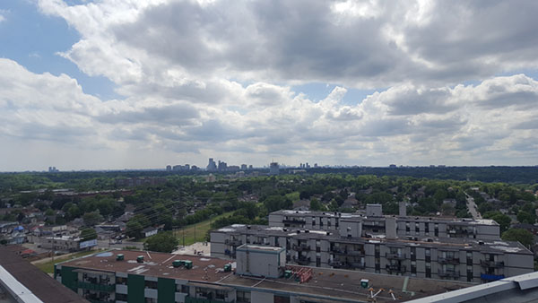
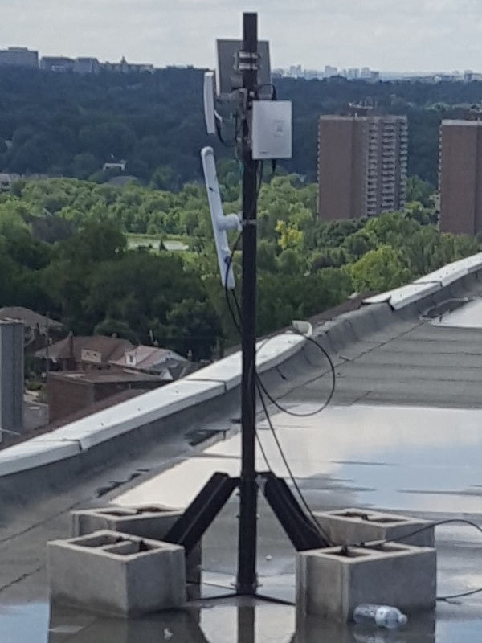
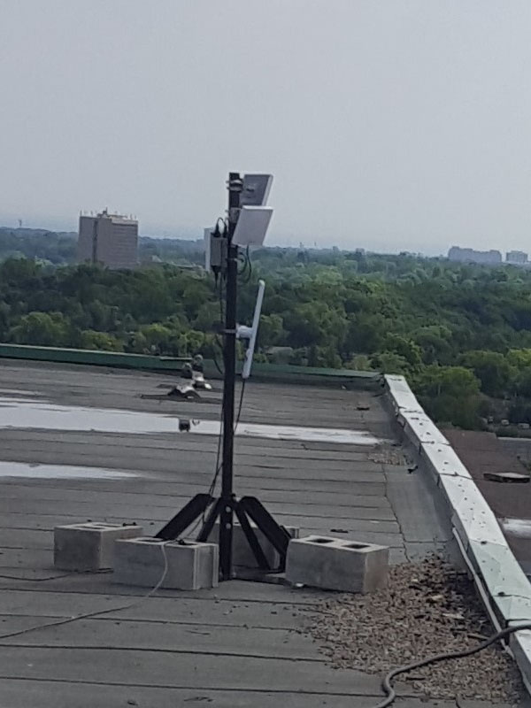
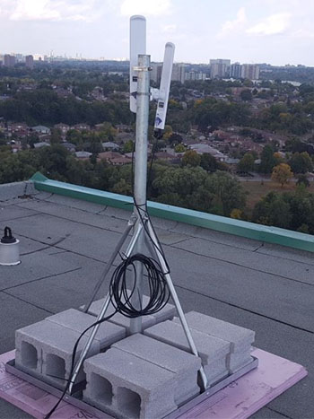
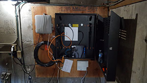
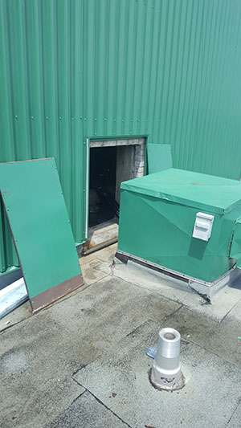
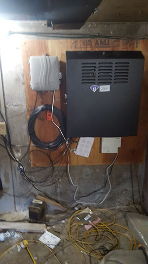

# Supernode 1

Supernode 1 is located on top of 200 Woolner Ave, Toronto, alongside Cisco-deployed infrastructure belonging to the City of Toronto.

## Network

The supernode consists of 2 antennas and a router. The router is connected to the Cisco switch which is connected to the Bell 2000 modem that offers internet access for use as a gateway path.

The router acts as a Babel routing device. The antennas are configured in bridge mode.

## Hardware

### Antenna 1

Antenna 1 is a [Ubiquiti LAP-120](https://www.ui.com/airmax/liteap-ac/) mounted on the west arm of the building, on the south side of the roof, colocated with Cisco on their mounts. The antenna is facing south.

### Antenna 2

Antenna 2 is a Ubiquiti LAP-120 mounted on the south arm of the building, on the east side of the roof, colocated with Cisco on their mounts. The antenna is facing east.

### Antenna 3 and 4

Antenna 3 and 4 are Ubiquiti LAP-120 devices mounted on the north-east arm of the building. Antenna 3 is facing north-east and antenna 4 is facing north.

### Router 1

Router 1 is a [Ubiquiti EdgeRouter X-SFP](https://www.ui.com/edgemax/edgerouter-x-sfp/) mounted inside the Cisco cabinet in the ballast room. It is connected to the exit node over a L2TP tunnel using UDP.

Router is configured with a static IP and only routes to the exit node and a secondary VPS server. The secondary VPS is used to provide an OpenVPN tunnel for secure remote management of the device.

## Physical Environment

The roof is accessible through ceiling hatches on the top floor of the building.

The router is installed in a black metal cabinet, located on the back wall of the ballast tank room on the roof. This room is accessible only from the roof. The entrance is on the east wall of the elevator hut. The doors are shorter than normal.

Network cables are run through a hole in the east wall.

## Neighbourhood Testing

Testing was done at several points that had line-of-sight to the antenna. The antenna was hand-held, not tuned precisely. Results are for reference only, and do not necessarily represent what a permanent deployment could attain at that distance.

| Point     | Distance (m) | Ping      |  Speed RX/TX (Mbps)   | Signal (dBm)   |
|-----------|--------------|-----------|-----------------------|----------------|
| a         | 200          | 4.57      |  86/194               | -64            |
| b         | 200          | 2.86      |  80/194               | -60            |
| c         | 237          | 5.82      |  50/178               | -58            |
| d         | 270          | 5.27      |  103/149              | -50            |
| e (1)     | 396          | 5.11      |  83/172               | -58            |
| f         | 2520         | 4.57      |  8.68/1.6             | -81            |
| f (2)     | 2520         | 4.57      |  64.58/40.79          | -74            |
| g         | 2660         |           |  82/123               | -62            |
| g (3)     | 2660         |           |  118/44               | -66            |

(1) Used both [Nanostation AC (Loco5AC)](https://www.ui.com/airmax/nanostation-ac/) and [LiteBeam AC (LBE‑5AC‑23)](https://www.ui.com/airmax/litebeam-ac/). Both performed the same.  
(2) Second attempt done after correcting issue with `sn1a2`.  
(3) Used [Nanostation AC (Loco5AC)](https://www.ui.com/airmax/nanostation-ac/) but could not adjust elevation.

## Additional Notes

EdgeRouter X-SFP does not accelerate traffic over tunnels. Due to this, speeds are currently limited to around 400Mbps to exit node.
