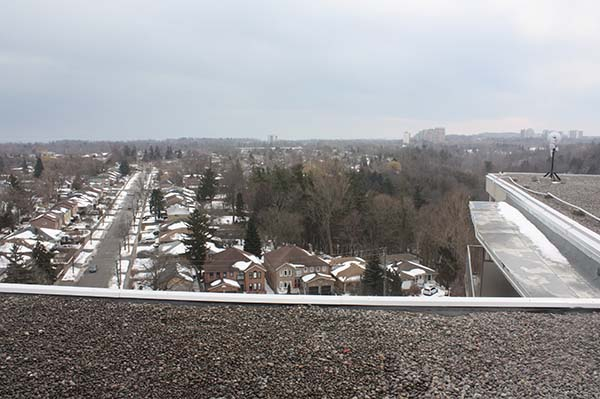
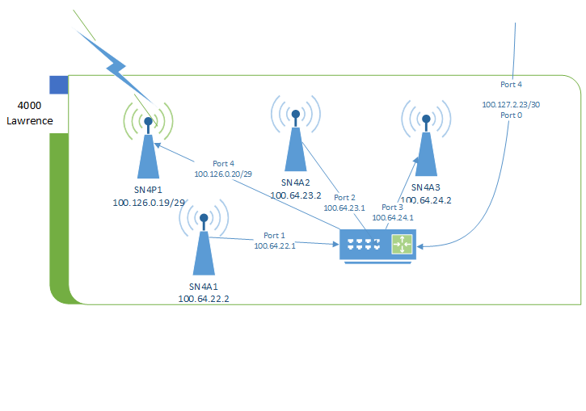
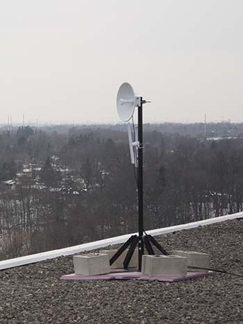
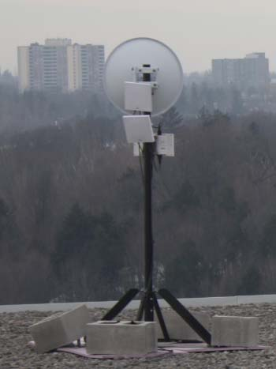
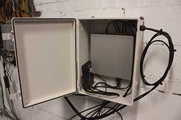

# Supernode 4

Supernode 4 is located on top of 4000 Lawrence Ave, Toronto, alongside Cisco-deployed infrastructure belonging to the City of Toronto.

## Network

The supernode consists of 4 antennas and a router. The router is connected to the Cisco switch. The switch is connected via a city owned bridged Power Beam to 3434 Eglington Ave West that offers internet access for use as a gateway path.

The router acts as a Babel routing device. The antennas are configured in bridge mode.

## Hardware

### Antenna 1, 2 and Point to Point Antenna 1

Antenna 1 and 2 are [Ubiquiti LAP-120](https://www.ui.com/airmax/liteap-ac/) mounted on the north arm of the building, on the west side of the roof. Antenna 1 is facing south-west. Antenna 2 if facing north.

Point to Point Antenna 1 is a [Ubiquiti PowerBeam AC Gen2](https://www.ui.com/airmax/powerbeam-ac-gen2/) mounted on the north arm of the building, on the west side of the roof. The antenna is facing south-west pointing to 25 Cougar in Supernode 3.

### Antenna 3

Antenna 3 is a [Ubiquiti LAP-120](https://www.ui.com/airmax/liteap-ac/) mounted on the south-east arm of the building, colocated with Cisco on their mount. The antenna if facing south-east.

### Router 1

Router 1 is a [Ubiquiti EdgeRouter X-SFP](https://www.ui.com/edgemax/edgerouter-x-sfp/) mounted inside the Cisco cabinet inside the main room on the roof. It is connected to the exit node over a L2TP tunnel using UDP.

Router is configured with a static IP and only routes to the exit node and a secondary VPS server. The secondary VPS is used to provide an OpenVPN tunnel for secure remote management of the device.

## Physical Environment

The roof is accessible by using the stairs located on the east end of the building. 

The router is installed in a white NEMA cabinet, located on the left wall of the roof top room. This room is accessible only from the roof across the walkway from the roof entrance.

Network cables are run through a hole in the south and north walls.

## Additional Notes

- EdgeRouter X-SFP does not accelerate traffic over tunnels. Due to this, speeds are currently limited to around 400Mbps to exit node.
- Layer 2 point to point link over city owned power beam provides gateway exit traffic from 3434 Eglington ave.
