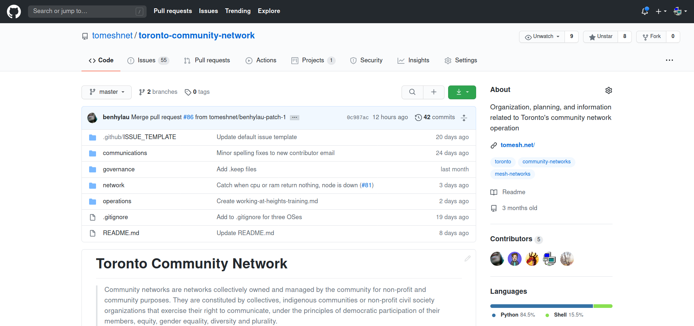
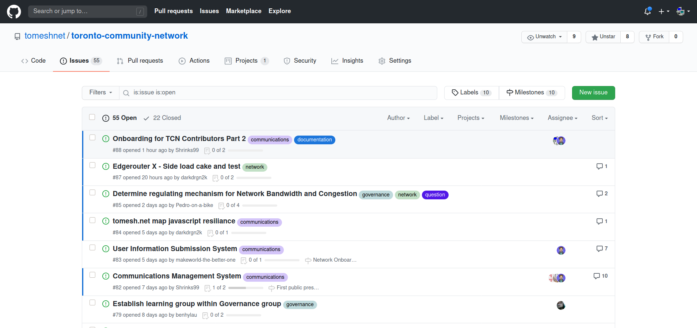
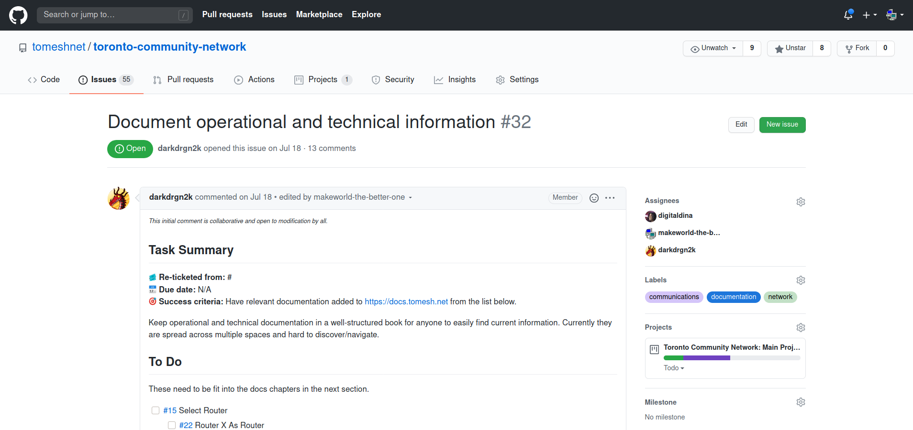
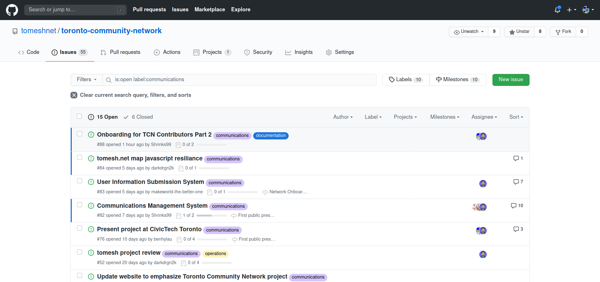
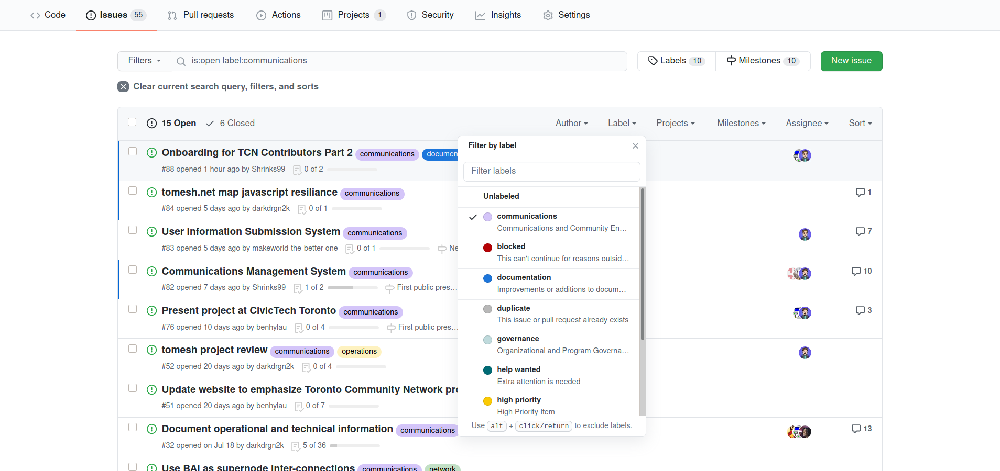
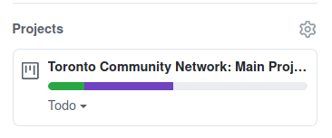
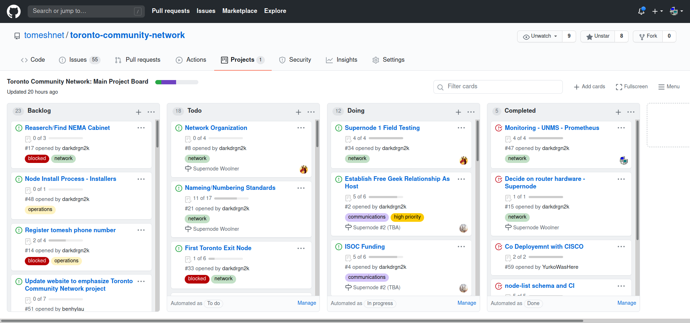

# GitHub Tickets

GitHub is a service that provides code hosting and versioning. We also use it for its collaborative features, such as issue/bug tracking and project boards. This documents explains how to use GitHub to keep track of tasks.

## Repositories

The main repository for the Toronto Community Network can be found on github under [tomeshenet/toronto-community-network](https://github.com/tomeshnet/toronto-community-network).

A repository (or "repo") is a collection of files, issues, and project boards grouped uner a name. The name of this one is `toronto-community-network` and that it was created by the [tomeshnet](https://github.com/tomeshnet) organization.

You can see an overview of the files and folders in the middle of screen, and below that you can see what's called the README, which is a file that explains what the repository is for. If you click on `README.md` you'll see it has the same contents as the text on the homepage.

## Issues

If you click on `Issues` tab you'll see this:

This tab provides a list of all the issues that have been created for this repository. Issues are similar to the idea of "tickets" or bug reports. It allows us to keep track of tasks or potential plans. All issues have numbers, referenced with a hashtag, such as #32, which can be found [here](https://github.com/tomeshnet/toronto-community-network/issues/32).

If you look at that issue (or any others), you will see an initial comment explaining what the issue is for, and a discussion going on below about the issue, with reactions, editing, links, etc. The initial comment will change and get edited by others over time as new information is known.

Issues also have assignees, which you can see in the sidebar. These are the users responsible for completing this task. You can assign yourself or other people.

Issues can either be open or closed, which denotes their completion. Issues are closed once they're no longer relevant, or when the original task or bug has been fixed.

## Labels

You'll notice on the sidebar that issues can have labels, projects, and milestones, which we'll get into later. If you click on a label, you can view all the issues with that label. For example, here are all the communications issues:

Using the sidebar, you can filter by other labels if needed.

## Projects

[#32](https://github.com/tomeshnet/toronto-community-network/issues/32) is also linked to a project, as can be seen in the sidebar.

If you click that text or click the Projects tab at the top, you'll be able to see the project. Repositories can have multiple projects, but in this repository there is just one. Here is what it looks like:

A GitHub Project is a type of [Kanban](https://en.wikipedia.org/wiki/Kanban_%28development%29) board for organizing issues.
Each of the cards are issues, which can be in different columns. We use a standard setup with To Do, Doing (aka "In Progress"), and Completed columns.
We also have a Backlog column on the far left for low-priority tasks. Issues can be moved from column to column as needed, to indicate their status. Issues will automatically be moved to Completed when they're closed.

Issues in the project can also be filtered by label by clicking on a label, for example you can see all the communications issues in the project [here](https://github.com/tomeshnet/toronto-community-network/projects/1?card_filter_query=label%3Acommunications).

## Creating your first issue

TODO
