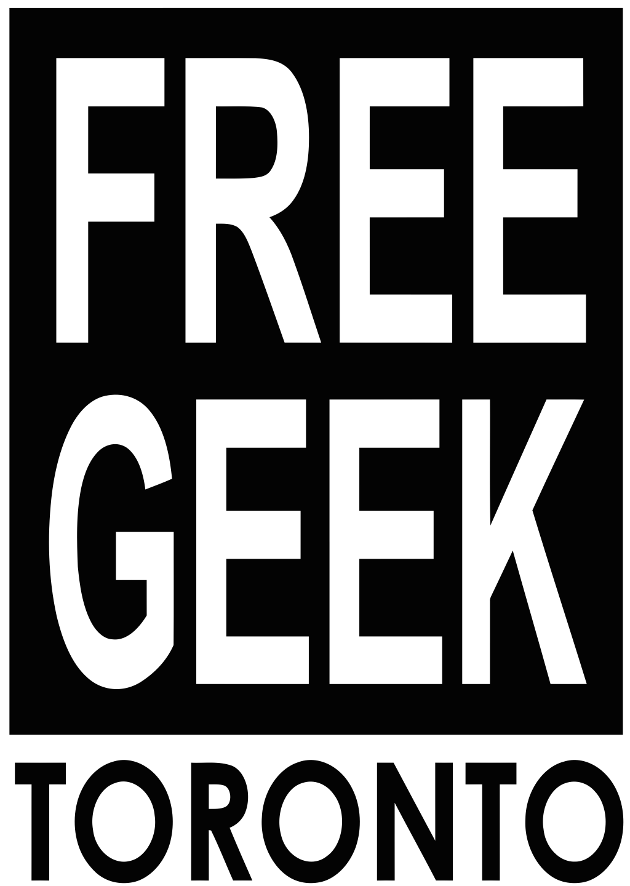

# Legal

Toronto Mesh is a community organization [established in 2016](https://tomesh.net/timeline/), stewarded by a group of individual contributors and supported by many value-aligned organizations.
It is not an independent legal entity.

The Toronto Community Network is a project led by the Toronto Mesh community, and adopts a multi-stakeholder model to its project governance.
Since neither Toronto Mesh or the Toronto Community Network has its own independent legal entity or bank accounts, it relies on trustees to provide fiscal administration capacity.

In order to work with many institutional collaborators, it is necessary for Toronto Mesh or the Toronto Community Network to engage into contractual agreements.
Depending on the nature of the collaboration, our [Organizational and Program Governance Working Group](./working-groups.html#organizational-and-program-governance) will designate appropriate signatories to sign the agreement on behalf of Toronto Mesh or the Toronto Community Network on a case-by-case basis.
On occasions where there must be a legal entity signing the agreement, such agreement shall be made with one of our supporting organizations instead.

## Collaborators and Supporters

## Licenses

Unless otherwise specified, Toronto Mesh **code** is licensed under [GNU General Public License v3.0](https://www.gnu.org/licenses/gpl-3.0.en.html), **content and documentation** is licensed under [Creative Commons Attribution-ShareAlike International 4.0 (CC BY-SA 4.0)](https://creativecommons.org/licenses/by-sa/4.0/).
